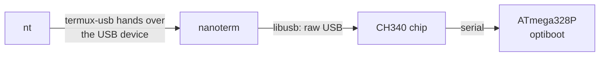

# nanoterm

**Program and talk to an Arduino Nano from an Android phone — no root, no
PC.** Also works on Linux.

```sh
arduino-cli compile -b arduino:avr:nano:cpu=atmega328 --output-dir build .
nt -u build/Blink.ino.hex -m      # upload, then watch Serial output
```

nanoterm is a serial terminal and sketch uploader for Arduino boards with a
**CH340** USB chip (most Nano clones, many Uno clones). Plug the board into
your phone, and from [Termux](https://termux.dev) you can upload sketches,
read `Serial.print()` output, and send it commands.

## Why this exists

Uploading to an Arduino normally needs a serial port like `/dev/ttyUSB0`.
Android doesn't give apps one without root, so `avrdude` — the uploader
behind the Arduino IDE and `arduino-cli upload` — can't run on a phone.

nanoterm skips the serial port. Android *does* let an app use a USB device
directly once you allow it, so nanoterm:

- drives the CH340 chip itself over raw USB with
  [libusb](https://libusb.info) (the kernel driver's job, done in user space);
- speaks the bootloader's upload protocol itself (STK500, what avrdude uses).



Compiling happens in `arduino-cli`, which runs in a small Debian container
on the phone (Arduino's compiler needs Linux's usual C library, which
Android doesn't have). `setup.sh` installs that for you, and a wrapper
makes `arduino-cli` work from plain Termux.

## What you need

- An Arduino Nano (or Uno/Pro Mini clone) with a **CH340** chip. It's the
  most common clone chip; on Linux it shows up in `lsusb` as `1a86:7523`.
- An Android phone and a cable: USB-C to the board's port, or an OTG adapter.
- [Termux](https://f-droid.org/packages/com.termux/) and
  [Termux:API](https://f-droid.org/packages/com.termux.api/) — **both
  from F-Droid.** Mixing sources (e.g. Termux from Google Play) breaks
  `termux-usb`.

## Setup (phone)

In Termux:

```sh
pkg install git
git clone https://github.com/allextraszza1488/nanoterm
cd nanoterm && ./termux/setup.sh
```

That installs the compiler and libusb, a Debian container with `arduino-cli`
and the AVR board package, and puts `nanoterm`, `nt` and the `arduino-cli`
wrapper on your PATH. It's safe to run again; finished steps are skipped.
Plan for a few minutes and some storage: the Arduino AVR toolchain alone is
~370 MB, on top of the Debian container.

## Using it (phone)

A sketch lives in a folder with the same name: `Blink/Blink.ino`.

```sh
cd Blink

# compile -> build/Blink.ino.hex
arduino-cli compile -b arduino:avr:nano:cpu=atmega328 --output-dir build .

# upload (the first time, Android asks to allow USB access: tap OK)
nt -u build/Blink.ino.hex

# serial monitor: see Serial.print() output, type a line + Enter to send
nt -t

# or both at once
nt -u build/Blink.ino.hex -m -t
```

`nt` finds the board, asks Android for permission, and runs nanoterm on it.
It takes all of nanoterm's options (below). Ctrl+C quits the terminal.

**Try it:** [examples/PhoneControl](examples/PhoneControl/PhoneControl.ino)
answers commands you type — `on`, `off`, `blink`, `status` — and drives the
board's LED:

```sh
cd examples/PhoneControl
arduino-cli compile -b arduino:avr:nano:cpu=atmega328 --output-dir build .
nt -u build/PhoneControl.ino.hex -m -t     # then type: on
```

## Linux

```sh
sudo apt install libusb-1.0-0-dev pkg-config   # Arch: pacman -S libusb pkgconf
make && sudo make install
sudo cp udev/99-ch340.rules /etc/udev/rules.d/
sudo udevadm control --reload && sudo udevadm trigger
nanoterm -t
```

The udev rule lets the `uucp` group (Arch) use the chip without root; on
Debian/Ubuntu change it to `dialout`. While nanoterm runs it borrows the
board from the kernel's `ch341` driver, so `/dev/ttyUSB0` disappears until
it exits.

## Options

| | |
|---|---|
| **Terminal** | |
| `-b BAUD` | Speed. Must match `Serial.begin()` in the sketch. Default 9600. |
| `-t` | Timestamp each received line (`14:02:31.508 ...`). |
| `-x` | Show received bytes as hex, 16 per line. |
| `-e EOL` | What's sent after each line you type: `lf` (default), `crlf`, `cr`, `none`. |
| `-l FILE` | Also append the session to FILE. Lines you sent are marked `> `. |
| `-n` | Don't reset the board on connect — attach to a sketch that's already running. |
| `-d SECS` | Exit after SECS seconds (for scripts). |
| **Upload** | |
| `-u HEX` | Upload a compiled sketch, verify it, exit. Use the plain `<sketch>.ino.hex`, not `with_bootloader.hex`. |
| `-U BAUD` | Bootloader speed: 115200 (default) or 57600 for Nanos sold as "old bootloader". |
| `-m` | After uploading, stay connected as a terminal. |
| `-v` | Print the upload byte by byte, with timings. |
| **Other** | |
| `-q` | No `[nanoterm]` status lines. |
| `-V`, `-h` | Version, help. |

Exit status: 0 success, 1 failure (no board, upload failed, …), 2 bad usage.
`nt` passes nanoterm's real exit status on, so `nt -u x.hex && nt -t`
won't open the terminal after a failed upload.

## Troubleshooting

**`termux-usb` hangs / `nt` never does anything.** The Termux:API *app* is
missing or from a different source than Termux. Install both from F-Droid,
open Termux:API once.

**`nt: no USB device found`.** Check the cable carries data (many
charge-only cables don't), and unlock the phone before plugging in. On
GrapheneOS, new USB devices are blocked while locked — see *Settings →
USB-C port*.

**`no answer from the bootloader`.** Try `-U 57600` (some Nano clones ship
the "old bootloader"). Make sure no other `nt`/nanoterm is running. Run
with `-v` to see exactly what the board sent back.

**Terminal shows garbage.** `-b` doesn't match the sketch's
`Serial.begin()` speed.

**`command substitution: ignored null byte in input`.** A harmless warning
from `termux-usb` itself when it exits.

## How it's tested

`make test` runs without a board:

- the HEX parser against real `arduino-cli` output, checked byte for byte
  against the program extracted from the ELF, plus malformed files;
- the uploader against a **simulated optiboot**
  ([tests/fake_optiboot.c](tests/fake_optiboot.c)) modelled on optiboot's
  source: reset timing, LED-flash startup, its 3-byte UART buffer overrun,
  going silent on garbled input, flaky resets, a dead board, the wrong chip,
  corrupted read-back;
- the CH340 baud-rate calculation (ported from the Linux driver) across
  common speeds.

CI runs them with gcc and clang, under AddressSanitizer and UBSan. Uploads
were tested on a real Nano (CH340, optiboot) from an Android phone in
Termux.

## Limitations

- CH340/CH341 USB chips only. Boards with a different USB chip (genuine
  Uno's ATmega16U2, FTDI, CP2102) aren't supported.
- ATmega328(P) boards with optiboot or the old bootloader: Nano, Uno, Pro
  Mini. The old-bootloader path (`-U 57600`) follows the same protocol but
  hasn't been tried on a real old-bootloader board.
- Flash only; no EEPROM upload.

## License

MIT
